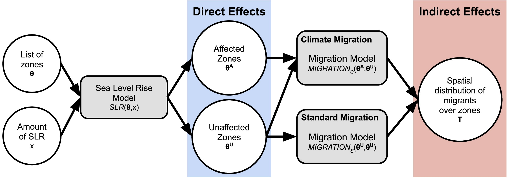

# Migration patterns under different scenarios of sea level rise

*NOTE*: Data available for download at (https://www.dropbox.com/s/32mdbjhr017azrw/migration-slr-data.zip?dl=0).

By: [Caleb Robinson](http://calebrob.com/), [Bistra Dilkina](https://viterbi.usc.edu/directory/faculty/Dilkina/Bistra), and [Juan Moreno-Cruz](https://www.morenocruz.org/).

[Paper link](https://arxiv.org/abs/1904.10160)

This reposoitory accompanies the manuscript, "Migration patterns under different scenarios of sea level rise", in submission to PLOS One. We study how the population distribution of the United States may change under different climate change scenarios by coupling human migration models with sea level rise models and population projections. As sea levels rise throughout the 21st century, large areas of previously habitable land will be directly innundated and/or exposed to more frequent extreme flooding events. This dynamic will displace vulnerable coastal populations, who will have to move to adapt to the climatic pressures. As we show, these migrants have the potential to signficantly shift the population landscape in the US by 2100.

Our work extends prior work by Hauer et al. [[1,2](#references)], by formalizing the coupling of migration and sea level rise models into a generalized *joint model* of migration under sea level rise, studying the impact of choice of migration model on the final results, and modeling different migration dynamics for affected vs. unaffected migrants.

Below, we detail the contents of the repository, and provide instructions for reproducing the paper results. (In progress)

## Explanation of existing files

### Code

### Data

## Reproducing results

### Reproducing population/SLR projections (Hauer et al. 2016)

### Hurricane affected counties

### Migration models (Robinson and Dilkina 2018)

### Final results

## References

[1] Hauer, Mathew E., Jason M. Evans, and Deepak R. Mishra. "Millions projected to be at risk from sea-level rise in the continental United States." Nature Climate Change 6.7 (2016): 691.

[2] Hauer, Mathew E. "Migration induced by sea-level rise could reshape the US population landscape." Nature Climate Change 7.5 (2017): 321.

[3] Robinson, Caleb, and Bistra Dilkina. "A machine learning approach to modeling human migration." Proceedings of the 1st ACM SIGCAS Conference on Computing and Sustainable Societies. ACM, 2018.